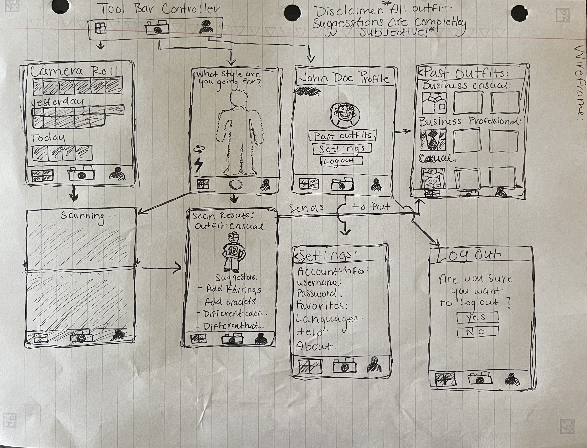

# cis-famu-semester-project-fitt-check

# Description: 
> PTSO. AI is an algorithm that helps users perfect their business professional, business casual, and casual outfits. It will give options on what needs to be changed to achieve these looks.  

# App Evaluation:
**Story:**
> The app analyzes the user's outfit through an image and classifies it into categories like Business Professional, Business Casual, or Casual. If the outfit does not fit the desired dress code, the app offers suggestions to improve the look and provides explanations for why a particular category was chosen. It serves users who want to ensure their outfits match appropriate attire requirements for various occasions, whether for work, formal events, or casual outings. 

**Market:** 
> This app can appeal to a broad audience, including professionals who need to adhere to dress codes, fashion enthusiasts looking for style feedback, and individuals preparing for events like job interviews, dates, or presentations. The app would be especially helpful for users who need guidance on fashion etiquette or who want to ensure their outfit aligns with the expectations of specific social or professional environments. 

**Habit:**
> Users could turn to this app regularly to check their daily outfit choices before leaving for work, interviews, or social events. It could also become a go-to resource for those attending special occasions where they want reassurance that their attire is appropriate. Frequent users may develop a habit of capturing their outfits daily, seeking fashion tips, or refining their style based on the app's suggestions. 

**Scope:**
> Initially, the app will focus on categorizing outfits and providing improvement suggestions based on dress codes. Future development could include personalized style recommendations, seasonal outfit guides, integration with shopping platforms for suggested items, and even fashion tracking over time to help users analyze their evolving sense of style. The app could eventually expand to offer social features, where users can share outfit choices with friends or a broader fashion community for further feedback. 

# Product Spec:
## 1. User Stories (Required and Optional)

**Required:**  
> PTSO.AI core functionality revolves around the ability to classify outfits into categories such as Business Professional, Business Casual, or Casual. The app must allow users to take pictures of themselves directly within the app and immediately scan and analyze their attire based on a pre-existing image database and the use of openAPI. If an outfit does not match the desired dress code, the app must offer suggestions for improving the outfit. This could include advice on changing specific items (e.g., swapping sneakers for dress shoes) to better fit the required attire category. Along with suggestions, the app should offer detailed explanations as to why a particular category was chosen, helping users understand the reasoning behind the classification. The user interface must be intuitive and focus solely on the outfit rather than other elements like background or facial features, ensuring reliability and ease of use for users of all skill levels. 

**Optional:** 
> Several optional features could further improve the app’s functionality and user experience. For instance, storing a history of the user's past outfit categorizations would allow users to track their style choices and analyze patterns over time. The app could also allow users to upload existing photos from their gallery for analysis, making it convenient to assess previously taken outfits. To add more practicality, the app could integrate with users' calendars to suggest appropriate outfits for upcoming events or provide weather-appropriate suggestions. Further customization, like adding user-defined attire categories or integrating privacy controls for uploaded images, could personalize the experience. Finally, social sharing options would make it easy for users to share their classified outfits with friends or on social media, making the app more engaging and interactive. 

## 2. Screens

- Login: 
Register - User signs up or logs into their account
Upon Download/Reopening of the application, the user is prompted to log in to gain access to their profile information  

- Picture screen: 
The screen will ask you for permission to use your camera and access your camera roll. It will give you options to choose a picture from your camera roll, take a picture, and choose the type of outfit you’re going for. After, you will be prompted to take or upload your picture. The top left will display a drop-down menu for you to select from business professional, business casual, or casual. In the navigation bar it will have an option to upload from your camera roll. In the bottom left it will have the option to flip the camera. In the bottom left it will have the option to turn the flash on. 

- Camera roll screen: 
If you decide to upload a picture from your camera roll this screen will allow you select that photo you want.

- Results & suggestions screen: 
This screen will tell you if your outfit matches the description you chose. If not, it will give you suggestions on how to fix it . It will also point to certain parts of your outfit giving you suggestions on what to fix 

- Hub: 
Shows the history of your past outfits that you uploaded and the suggestions that were given and your profile. 

## 3. Navigation

**Tab Navigation (tab to screen):** 
- Choosing a picture from your camera roll , Accessing your hub that shows your history 

**Flow Navigation (screen to screen):**
- Forced Log-in -> Account creation if no log in is available
- Picture screen -> take a picture or upload an existing picture
- Camera roll -> If you chose to use an existing photo
- Suggestions -> how to improve your outfit based off the option you chose
- Hub -> access to your history and profile 

# Wireframe:

# Interactive Prototype:

# Schema

**User Model:**
| Field          | Type           | Description                                   |
|----------------|----------------|-----------------------------------------------|
| userId         | String         | Unique identifier for each user (default).    |
| username       | String         | Username chosen by the user.                  |
| email          | String         | User’s email address.                         |
| passwordHash   | String         | Hashed password for security.                 |
| profileImage   | File           | User’s profile picture (optional).            |
| createdAt      | DateTime       | Date the user account was created (default).  |
| updatedAt      | DateTime       | Last update to the user profile (default).    |

**Outfit Model:**
| Field          | Type            | Description                                   |
|----------------|-----------------|-----------------------------------------------|
| outfitId       | String          | Unique ID for each outfit (default).          |
| userId         | Pointer to User | Reference to the user who uploaded the outfit.|
| image          | File            | Image of the outfit uploaded by the user.     |
| category       | String          | The category assigned (e.g., "Business Casual").|
| suggestions    | Array of Strings| Suggestions for improvement (if needed).      |
| createdAt      | DateTime        | Date the outfit was uploaded (default).       |
| updatedAt      | DateTime        | Date of last update to the outfit (default).  |

**Classification Model:**
| Field             | Type            | Description                                   |
|-------------------|-----------------|-----------------------------------------------|
| classificationId  | String          | Unique ID for each classification (default).  |
| outfitId          | Pointer to Outfit| Reference to the related outfit.              |
| category          | String          | The determined category (e.g., "Business Professional").|
| confidenceScore   | Number          | Confidence score of the classification.       |
| suggestions       | Array of Strings | Suggestions to improve the outfit.            |
| createdAt         | DateTime        | Date the classification was generated (default).|

**History Model:**
| Field             | Type            | Description                                   |
|-------------------|-----------------|-----------------------------------------------|
| historyId         | String          | Unique ID for each history entry (default).   |
| userId            | Pointer to User | Reference to the user.                        |
| outfitId          | Pointer to Outfit| Reference to the uploaded outfit.             |
| classificationId  | Pointer to Classification | Reference to the classification.         |
| createdAt         | DateTime        | Date the history entry was recorded (default).|

Networking
List of network requests by screen
Home Feed Screen
(Read/GET) Query all posts where user is author
let query = PFQuery(className:"Post")
query.whereKey("author", equalTo: currentUser)
query.order(byDescending: "createdAt")
query.findObjectsInBackground { (posts: [PFObject]?, error: Error?) in
   if let error = error { 
      print(error.localizedDescription)
   } else if let posts = posts {
      print("Successfully retrieved \(posts.count) posts.")
  // TODO: Do something with posts...
   }
}
**Endpoints:**
| Method | Endpoint              | Description                                                                 | Example Query                                                        |
|--------|-----------------------|-----------------------------------------------------------------------------|----------------------------------------------------------------------|
| POST   | /login                | User logs in or creates an account.                                         | { "username": "user1", "password": "password123" }                    |
| GET    | /outfit/analyze       | Analyze an uploaded outfit image to classify it (e.g., Business, Casual).   | { "image_url": "http://example.com/image.jpg", "category": "Business Casual" } |
| POST   | /outfit/analyze       | Upload an image and classify based on selected category.                    | { "image_file": [binary data], "category": "Casual" }                 |
| GET    | /outfit/suggestions   | Get suggestions for improving the uploaded outfit based on category.        | { "outfit_id": "12345" }                                              |
| POST   | /outfit/suggestions   | Provide improvement suggestions for a specific outfit.                      | { "outfit_id": "12345", "suggestions": ["swap sneakers for dress shoes"] } |
| GET    | /user/history         | Get the history of all outfit analyses and suggestions for the user.        | { "user_id": "12345" }                                                |
| GET    | /outfit/:id           | Get details of a specific outfit and its analysis results.                  | /outfit/12345                                                         |
| PUT    | /user/profile/image   | Update user profile image.                                                  | { "user_id": "12345", "image_file": [binary data] }                   |

